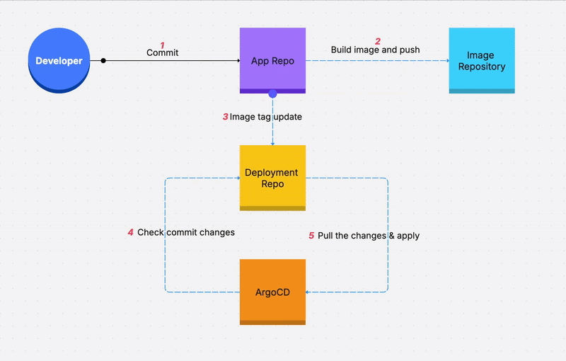

# Grade Service - Application Repository

This repository contains the **application source code** for the Grade Service, which is part of a GitOps workflow managed by ArgoCD.

## GitOps Architecture Overview

This project follows the **GitOps pattern** with two separate repositories:

```
┌─────────────────────────┐    ┌──────────────────────────┐
│   k8s-argocd-app        │    │  k8s-argocd-deployment   │
│  (This Repository)      │    │                          │
│                         │    │                          │
│  • Application Code     │    │  • Kubernetes Manifests  │
│  • Dockerfile           │    │  • ArgoCD Applications   │
│  • Dependencies         │    │                          │
└─────────────────────────┘    └──────────────────────────┘
         │                                    │
         │                                    │
         ▼                                    ▼
┌─────────────────────────┐    ┌──────────────────────────┐
│    CI Pipeline          │    │       ArgoCD             │
│                         │    │                          │
│  • Build Docker Image   │───▶│  • Monitors Deployment   │
│  • Push to Registry     │    │    Repository            │
│  • Update Manifests     │    │  • Syncs to Kubernetes   │
└─────────────────────────┘    │  • Manages Rollbacks     │
                               └──────────────────────────┘
```


## GitOps Workflow

### 1. **Development Phase** (This Repository)
- Developers push code changes to this repository
- Contains application source code (`src/app.js`)
- Contains build instructions (`Dockerfile`)
- Contains application dependencies (`package.json`)

### 2. **CI/CD Pipeline**
When code is pushed to this repository:
```bash
# Automatic CI Pipeline Triggers:
1. Build Docker image from source code
2. Tag image with commit SHA or version
3. Push image to container registry
4. Update deployment repository with new image tag
```

## Related Repositories
- **App Repository**: `k8s-argocd-app` - Application source code and Dockerfile (this repository)
- **Deployment Repository**: `k8s-argocd-deployment` - Contains Kubernetes manifests
- **Container Registry**: Built images are pushed to your configured registry

## ArgoCD Integration [local setup instructions]
```
## Install ArgoCD CLI
helm repo add argo https://argoproj.github.io/argo-helm
helm repo update
kubectl create namespace argocd
helm install argocd argo/argo-cd --namespace argocd

## Browse ArgoCD UI
kubectl port-forward svc/argocd-server -n argocd 8080:80
## Get initial admin password
kubectl -n argocd get secret argocd-initial-admin-secret -o jsonpath="{.data.password}" | base64 -d

## Apply ArgoCD Application
kubectl apply -f argocd-app.yaml
kubectl create secret docker-registry ghcr-secret \
  --docker-server=ghcr.io \
  --docker-username=<USERNAME> \
  --docker-password=<REGISTERY_TOKEN> \
  --namespace=default
```

## Getting Started

1. **Clone this repository** for application development
2. **Make code changes** in the `src/` directory  
3. **Push changes** - CI pipeline handles the rest
4. **Monitor deployment** via ArgoCD UI or CLI

---

*This repository is part of a GitOps workflow. For deployment configuration, see the `k8s-argocd-deployment` repository.*
